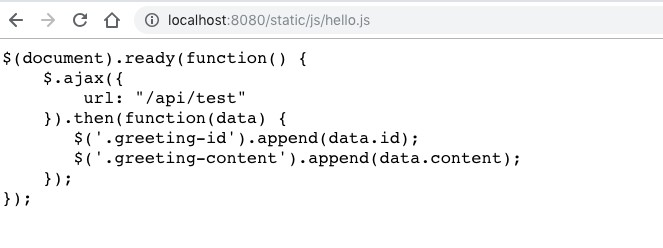
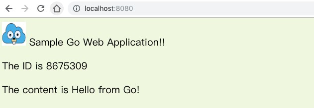
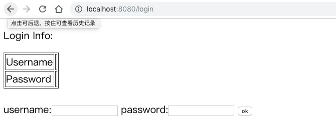
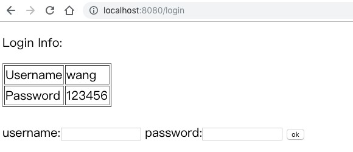

# 开发Web服务程序

## 1、概述

开发简单 web 服务程序 cloudgo，了解 web 服务器工作原理。

**任务目标**

1. 熟悉 go 服务器工作原理
2. 基于现有 web 库，编写一个简单 web 应用类似 cloudgo。
3. 使用 curl 工具访问 web 程序
4. 对 web 执行压力测试

**相关知识**

课件：

http://blog.csdn.net/pmlpml/article/details/78404838

https://blog.csdn.net/pmlpml/article/details/78539261

## 2、任务要求

本次实验分为两部分，第一部分完成了以下阅读任务：

1. 选择 net/http 源码，通过源码分析、解释一些关键功能实现
2. 选择简单的库，如 mux 等，通过源码分析、解释它是如何实现扩展的原理，包括一些 golang 程序设计技巧。


<a href="## 5、代码实验">第二部分为简单处理web程序的输入输出</a>


## 3、net/http源码剖析

Web Server执行流程


1. 创建Listen Socket, 监听指定的端口, 等待客户端请求到来。

2. Listen Socket接受客户端的请求, 得到Client Socket, 接下来通过Client Socket与客户端通信。

3. 创建go线程处理一个客户端的请求, 首先从Client Socket读取HTTP请求的协议头, 如果是POST方法, 还可能要读取客户端提交的数据, 然后交给相应的handler处理请求, handler处理完毕准备好客户端需要的数据, 通过Client Socket写给客户端。

   ​

根据源码对net/http包的请求处理进行剖析，具体注意一下方法：

- 关注函数、方法参数中的 接口和函数参数，是接口一定要了解接口的定义。OO 设计原理与模式大概率从这里开始
- 随时查阅 API 文档，了解相关类型的属性与方法
- 忽视任何错误处理、分支处理。尽管其中有许多有趣的东西，也要放弃
- 其中特别注意闭包、匿名函数、匿名类型这些编程技巧
- 特别注意接口断言语法 var.(type)
- 线程要注意上下文对象（context）的构建


1. Server结构体

```go
type Server struct {
    Addr         string        // TCP address to listen on, ":http" if empty
    Handler      Handler       //处理器,如果为空则使用 http.DefaultServeMux 
    ReadTimeout  time.Duration 
    WriteTimeout time.Duration 
    ....
}
```

2. Server监听和分发路由

```go
func (srv *Server) ListenAndServe() error {
    addr := srv.Addr
    if addr == "" {
        addr = ":http"
    }
    //注册一个tcp的监听器，监听端口
    ln, err := net.Listen("tcp", addr)
    if err != nil {
        return err
    }
    //回调
    return srv.Serve(tcpKeepAliveListener{ln.(*net.TCPListener)})
}
```

3. 循环接收请求

```go
//处理客户端的请求信息
func (srv *Server) Serve(l net.Listener) error {
	defer l.Close()
	var tempDelay time.Duration // how long to sleep on accept failure
	for {
        //通过Listener接收请求
		rw, e := l.Accept()
		if e != nil {
			if ne, ok := e.(net.Error); ok && ne.Temporary() {
				if tempDelay == 0 {
					tempDelay = 5 * time.Millisecond
				} else {
					tempDelay *= 2
				}
				if max := 1 * time.Second; tempDelay > max {
					tempDelay = max
				}
				log.Printf("http: Accept error: %v; retrying in %v", e, tempDelay)
				time.Sleep(tempDelay)
				continue
			}
			return e
		}
		tempDelay = 0
        //创建一个Conn，这个Conn里面保存了该次请求的信息，然后再传递到对应的handler，该handler中便可以读取到相应的header信息，这样保证了每个请求的独立性。
		c, err := srv.newConn(rw)
		if err != nil {
			continue
		}
        //为每次请求开一个goroutine，保证高并发
		go c.serve()
	}
}
```

4. goroutines处理请求

与我们一般编写的http服务器不同, Go为了实现高并发和高性能, 使用了goroutines来处理Conn的读写事件, 这样每个请求都能保持独立，相互不会阻塞，可以高效的响应网络事件。

```go
func (c *conn) serve(ctx context.Context) {
    // 客户端主机ip
    c.remoteAddr = c.rwc.RemoteAddr().String()
        ....

    // HTTP/1.x from here on.
    // 读取请求的数据
    c.r = &connReader{r: c.rwc}
    c.bufr = newBufioReader(c.r)
    c.bufw = newBufioWriterSize(checkConnErrorWriter{c}, 4<<10)

    ctx, cancelCtx := context.WithCancel(ctx)
    defer cancelCtx()

    for {
        //分析请求
        w, err := c.readRequest(ctx)
        ......
        //conn.server内部是调用了http包默认的路由器，通过路由器把本次请求的信息传递到了后端的处理函数。
        serverHandler{c.server}.ServeHTTP(w, w.req)
        ...
    }
}
```

5. 映射url与handlefunc()

```go
type serverHandler struct {
    srv *Server
}

func (sh serverHandler) ServeHTTP(rw ResponseWriter, req *Request) {
    
    handler := sh.srv.Handler
    if handler == nil {
        //最初传的参数就是 nil
        handler = DefaultServeMux
    }
    if req.RequestURI == "*" && req.Method == "OPTIONS" {
        handler = globalOptionsHandler{}
    }

    handler.ServeHTTP(rw, req)
}
```

6. 如果handle为空，则置为DefaultServeMux，然后选择相应的handle调用。

默认的路由器实现了`ServeHTTP`

```Go
func (mux *ServeMux) ServeHTTP(w ResponseWriter, r *Request) {
    //是*那么关闭链接
	if r.RequestURI == "*" {
		w.Header().Set("Connection", "close")
		w.WriteHeader(StatusBadRequest)
		return
	}
    //调用mux.Handler(r)返回对应设置路由的处理Handler，然后执行h.ServeHTTP(w, r)
	h, _ := mux.Handler(r)
	h.ServeHTTP(w, r)
}
```


总体流程：

- 首先调用Http.HandleFunc

  按顺序做了几件事：

  1 调用了DefaultServeMux的HandleFunc

  2 调用了DefaultServeMux的Handle

  3 往DefaultServeMux的map[string]muxEntry中增加对应的handler和路由规则

- 其次调用http.ListenAndServe(":9090", nil)

  按顺序做了几件事情：

  1 实例化Server

  2 调用Server的ListenAndServe()

  3 调用net.Listen("tcp", addr)监听端口

  4 启动一个for循环，在循环体中Accept请求

  5 对每个请求实例化一个Conn，并且开启一个goroutine为这个请求进行服务go c.serve()

  6 读取每个请求的内容w, err := c.readRequest()

  7 判断handler是否为空，如果没有设置handler（这个例子就没有设置handler），handler就设置为DefaultServeMux

  8 调用handler的ServeHttp

  9 在这个例子中，下面就进入到DefaultServeMux.ServeHttp

  10 根据request选择handler，并且进入到这个handler的ServeHTTP

  ```
    mux.handler(r).ServeHTTP(w, r)
  ```

  11 选择handler：

  A 判断是否有路由能满足这个request（循环遍历ServeMux的muxEntry）

  B 如果有路由满足，调用这个路由handler的ServeHTTP

  C 如果没有路由满足，调用NotFoundHandler的ServeHTTP


## 4、框架选择

- 简单应用：应选择自带库 `net/http`
- 一般 web 应用与服务开发：建议选择轻量组件 [gorilla/mux](http://www.gorillatoolkit.org/pkg/mux) + [codegangsta/negroni](http://github.com/codegangsta/negroni) + …
- web 开发: [beego](https://github.com/astaxie/beego)、[Martini](https://github.com/go-martini/martini)、[revel](http://revel.github.io/) ……


### gorilla/mux

> 参考：https://studygolang.com/articles/7268

golang自带的http.SeverMux路由实现简单，本质是一个map[string]Handler，是请求路径与该路径对应的处理函数的映射关系。实现简单功能也比较单一：

1. 不支持正则路由， 这个是比较致命的 
2. 只支持路径匹配，不支持按照Method，header，host等信息匹配，所以也就没法实现RESTful架构 

而gorilla/mux是一个强大的路由，小巧但是稳定高效，不仅可以支持正则路由还可以按照Method，header，host等信息匹配，可以从我们设定的路由表达式中提取出参数方便上层应用，而且完全兼容http.ServerMux


源码学习

1. Router

```go
type Router struct {
    //路由信息存放在一个Route类型的数组（[]Route）中
    routes []*Route
}
// Match matches registered routes against the request.
func (r *Router) Match(req *http.Request, match *RouteMatch) bool {
    for _, route := range r.routes {
        //Route.Match会检查http.Request是否满足其设定的各种条件(路径，Header，Host..)
        if route.Match(req, match) {
            return true
        }
    }
    return false
}

func (r *Router) ServeHTTP(w http.ResponseWriter, req *http.Request) {
    var match RouteMatch
    var handler http.Handler
    if r.Match(req, &match) {
        //找到第一个匹配的路由
        handler = match.Handler
    }
    if handler == nil {
        handler = http.NotFoundHandler()
    }
    handler.ServeHTTP(w, req)
}
```

2. Route

```go
type Route struct {
     // Request handler for the route.
    handler http.Handler
    
    // List of matchers.
    // 当我们添加路由限定条件时，就是往matcher数组中增加一个限定函数。 
    // 当请求到来时，Route.Match()会遍历matcher数组，只有数组中所有的元素都返回true时则说明此请求满足该路由的限定条件。
    matchers []matcher
}

//假设我们规定只能以GET方式访问/user/{userid:[0-9]+}并且header中必须包含“Refer”:"example.com"，才能得到我们想要的结果我们可以这样设置路由
r.HandleFunc("/user/{userid:[0-9]+}", userHandler)
.Methods("GET")
.Headers("Refer", "example.com")

//添加路由限定条件时，就是往matcher数组中增加一个限定函数

// 1.添加Header限定条件，请求的header中必须含有“Refer”,值为“example.com” 
func (r *Route) Headers(pairs ...string) *Route {
    if r.err == nil {
        var headers map[string]string
        //mapFromPairs返回一个map[string][string]{"Refer":"example.com"}
        headers, r.err = mapFromPairs(pairs...)
        return r.addMatcher(headerMatcher(headers))
    }
    return r
}

// 2.添加Method限定条件，请求的方法必须为“GET”
func (r *Route) Methods(methods ...string) *Route {
    for k, v := range methods {
        //转换成大写
        methods[k] = strings.ToUpper(v)
    }
    return r.addMatcher(methodMatcher(methods))
}

// 3.添加Path限定条件，请求的路径必须为“/user/{userid:[0-9]+}”。
// 带有正则表达式路径匹配是比较复杂的 tpl就是/user/{userid:[0-9]+}
func (r *Route) Path(tpl string) *Route {
    r.err = r.addRegexpMatcher(tpl, false, false, false)
    return r
}

//Route.Match()会遍历matcher数组，只有数组中所有的元素都返回true时则说明此请求满足该路由的限定条件。

// 1.匹配Header
type headerMatcher map[string]string
func (m headerMatcher) Match(r *http.Request, match *RouteMatch) bool {
    //matchMap会判断r.Header是否含有“Refer”,并且值为“example.com” 
    return matchMap(m, r.Header, true)
}

// 2.匹配Method
//methodMatcher就是取出r.Method然后判断该方式是否是设定的Method
type methodMatcher []string
func (m methodMatcher) Match(r *http.Request, match *RouteMatch) bool {
    return matchInArray(m, r.Method)
}

// 3.匹配Path
func (r *routeRegexp) Match(req *http.Request, match *RouteMatch) bool {
    return r.regexp.MatchString(getHost(req))
}
```

```go
//接之前限定Path正则的函数
func (r *Route) addRegexpMatcher(tpl string,strictSlash bool) error {
    //braceIndices判断{ }是否成对并且正确出现，idxs是'{' '}'在表达式tpl中的下标数组
    idxs, errBraces := braceIndices(tpl)
    
    template := tpl
    defaultPattern := "[^/]+"
    //保存所需要提取的所有变量名称，此例是userid
    varsN := make([]string, len(idxs)/2)
    var end int //end 此时为0
    pattern := bytes.NewBufferString("")
    for i := 0; i < len(idxs); i += 2 {
        raw := tpl[end:idxs[i]] //raw="/user/"
        end = idxs[i+1]
        parts := strings.SplitN(tpl[idxs[i]+1:end-1], ":", 2) //parts=[]{"userid","[0-9]+"}
        name := parts[0]  //name="userid"
        patt := defaultPattern
        if len(parts) == 2 {
            patt = parts[1] //patt="[0-9]+"
        }
        //构造出最终的正则表达式 /usr/([0-9]+)
        fmt.Fprintf(pattern, "%s(%s)", regexp.QuoteMeta(raw), patt)
        varsN[i/2] = name //将所要提取的参数名userid保存到varsN中
    }//如果有其他正则表达式继续遍历
      raw := tpl[end:]
    pattern.WriteString(regexp.QuoteMeta(raw))
    if strictSlash {
        pattern.WriteString("[/]?")
    }
    //编译最终的正则表达式
    reg, errCompile := regexp.Compile(pattern.String())
    
    rr = &routeRegexp{
        template:    template,
        regexp:      reg,
        varsN:       varsN,
    }
    r.addMatcher(rr)
}
```


### codegangsta/negroni

在 Go 语言里，Negroni 是一个很地道的 Web 中间件，它是一个具备微型、非嵌入式、鼓励使用原生 `net/http` 库特征的中间件。Negroni **不**是一个框架，它是为了方便使用 `net/http` 而设计的一个库而已。


Negroni 没有带路由功能，使用 Negroni 时，需要找一个适合你的路由。不过好在 Go 社区里已经有相当多可用的路由，Negroni 更喜欢和那些完全支持 `net/http` 库的路由搭配使用，比如搭配 [Gorilla Mux](http://github.com/gorilla/mux) 路由器。

```go
router := mux.NewRouter()
router.HandleFunc("/", HomeHandler)

n := negroni.New(Middleware1, Middleware2)
// Or use a middleware with the Use() function
n.Use(Middleware3)
// router goes last
n.UseHandler(router)

n.Run(":3000")
```

`negroni.Classic()` 提供一些默认的中间件，这些中间件在多数应用都很有用。

- `negroni.Recovery` - 异常（恐慌）恢复中间件
- `negroni.Logging` - 请求 / 响应 log 日志中间件
- `negroni.Static` - 静态文件处理中间件，默认目录在 "public" 下.


## 5、代码实验

本次实验的第二部分完成了以下要求：

1. 设计一个 web 小应用，展示静态文件服务、js 请求支持、模板输出、表单处理、Filter 中间件设计等方面的能力。（不需要数据库支持）
2. 支持静态文件服务
3. 支持简单 js 访问
4. 提交表单，并输出一个表格
5. 对 `/unknown` 给出开发中的提示，返回码 `5xx`
6. 使用 curl 测试，将测试结果写入 README.md
7. 使用 ab 测试，将测试结果写入 README.md。并解释重要参数。


### 一、静态文件服务

文件结构：

```
github.com/hansenbeast/cloudgo-io
	|--assets
		|--js
		|--image
		|--css
		|--index.html
	|--main.go
	|--service
		|--server.go
		|--apitest.go
		|--handler.go
	|--templates
		|--index.html
		|--5xx.html
		|--login.html
		|--table.html
	|--main.go
```

```go
package service

import (
    "net/http"
    "os"

    "github.com/codegangsta/negroni"
    "github.com/gorilla/mux"
    "github.com/unrolled/render"
)

// NewServer configures and returns a Server.
func NewServer() *negroni.Negroni {

    formatter := render.New(render.Options{
        IndentJSON: true,
    })

    n := negroni.Classic()
    mx := mux.NewRouter()

    initRoutes(mx, formatter)

    n.UseHandler(mx)
    return n
}

func initRoutes(mx *mux.Router, formatter *render.Render) {
    webRoot := os.Getenv("WEBROOT")
    if len(webRoot) == 0 {
        if root, err := os.Getwd(); err != nil {
            panic("Could not retrive working directory")
        } else {
            webRoot = root
            //“.../gowork/src/github.com/hansenbeast/cloudgo-io"
            fmt.Println(webRoot)
        }
    }

    //mx.HandleFunc("/api/test", apiTestHandler(formatter)).Methods("GET")
    
    //将 path 以 “/” 前缀的 URL 都定位到 webRoot + "/assets/" 为虚拟根目录的文件系统
    mx.PathPrefix("/").Handler(http.FileServer(http.Dir(webRoot + "/assets/")))
    
    //注解
    /*
    1. http.Dir 是类型。将字符串转为 http.Dir 类型，这个类型实现了 FileSystem 接口。（Dir 不是函数）
    2. http.FileServer() 是函数，返回 Handler 接口，该接口处理 http 请求，访问 root 的文件请求。
    3. mx.PathPrefix 添加前缀路径路由。
    */

}
```

空assets目录


在assets中添加index.html，并添加相应的js，css，image文件

```html
<html>
<head>
  <link rel="stylesheet" href="css/main.css"/>
  <script src="http://code.jquery.com/jquery-latest.js"></script>
  <script src="js/hello.js"></script>
</head>
<body>
  
  Sample Go Web Application!!
      <div>
          <p class="greeting-id">The ID is </p>
          <p class="greeting-content">The content is </p>
      </div>
</body>
</html>
```


### 二、支持 JavaScript 访问

输出一个 JSON (JavaScript Object Notation) 序列化的匿名结构。

```go
// service/apitest.go
package service

import (
    "net/http"

    "github.com/unrolled/render"
)

func apiTestHandler(formatter *render.Render) http.HandlerFunc {

    return func(w http.ResponseWriter, req *http.Request) {
        formatter.JSON(w, http.StatusOK, struct {
            ID      string `json:"id"`
            Content string `json:"content"`
        }{ID: "8675309", Content: "Hello from Go!"})
    }
}
```


web 应用控制台 Negroni 输出追踪，获知网页使用 javascript 获取了信息。


### 三、处理静态路径前缀

```Go
mx.PathPrefix("/static").Handler(http.StripPrefix("/static/", http.FileServer(http.Dir(webRoot+"/assets/"))))
```

删除assets中index.html后的结果





### 四、使用模版输出

1. 在当前目录下，建立 `assets` 和 `templates` 目录。 index.html 在 templates 目录中


2. 使用formatter构建，指定了模板的目录，模板文件的扩展名 

```go
formatter := render.New(render.Options{
        Directory:  "src/github.com/hansenbeast/cloudgo-io/templates",
        Extensions: []string{".html"},
        IndentJSON: true,
    })

...
//使用模版
mx.HandleFunc("/", homeHandler(formatter)).Methods("GET")
```

3. 添加handler.go，并让homeHandler 使用模板

```go
func homeHandler(formatter *render.Render) http.HandlerFunc {

    return func(w http.ResponseWriter, req *http.Request) {
        formatter.HTML(w, http.StatusOK, "index", struct {
            ID      string `json:"id"`
            Content string `json:"content"`
        }{ID: "8675309", Content: "Hello from Go!"})
    }
}
```

4. 修改templates中的index.html

其中 `{{.}}` 表示数据填充位置。 `{{.ID}}` 表示该数据的 ID 属性。

```html
<html>
<head>
  <link rel="stylesheet" href="css/main.css"/>
</head>
<body>
  
  Sample Go Web Application!!
      <div>
          <p class="greeting-id">The ID is {{.ID}}</p>
          <p class="greeting-content">The content is {{.Content}}</p>
      </div>
</body>
</html>
```

实验结果：



当第二次静态访问css和js时，发现第二次访问时间明显减少，是由于Web服务器缓存的原因。304状态码表示：

客户端发送了一个带条件的GET 请求且该请求已被允许，而文档的内容（自上次访问以来或者根据请求的条件）并没有改变，则服务器应当返回这个304状态码。简单的表达就是：客户端已经执行了GET，但文件未变化。


### 五、提交表单，并输出一个表格

1. 在templates中新建login.html和table.html

```html
<html>
    <head>
      <title>cloudgo-io</title>
      <meta http-equiv="Content-Type" content="text/html;charset=utf-8">
    </head>
    <body>
      <br>
      <div id="d">
      <form name="myform" action="/login" method="post">
        username:<input type="text" name="username">
        password:<input type="password" name="password">
        <input type="submit" value="login";>
      </form>
      </div>
    </body>
</html>
```

```html
<!DOCTYPE html>
<html>
  <head>
    <meta charset="utf-8">
    <title>Table</title>
  </head>

  <body>
    <p>Login Info: </p>
    <table border="1">
    <tr>
      <td>Username</td>
      <td>{{.Username}}</td>
    </tr>
    <tr>
      <td>Password</td>
      <td>{{.Password}}</td>
    </tr>
    </table>
  </body>
</html>
```

2. 在server.go中的路由绑定loginHandler

```go
//提交表单，并输出一个表格
mx.HandleFunc("/login", loginHandler(formatter))
```

3. 在handler.go中添加处理函数

```go
func loginHandler(formatter *render.Render) http.HandlerFunc {

    return func(w http.ResponseWriter, req *http.Request) {
      if req.URL.Path == "/login" {
        t, err := template.ParseFiles("src/github.com/hansenbeast/cloudgo-io/templates/login.html")
  
        req.ParseForm()
        ua := req.FormValue("username")
        pa := req.FormValue("password")
        formatter.HTML(w, http.StatusOK, "table", struct {
          Username      string `json:"username"`
          Password        string `json:"password"`
        } {Username: ua, Password: pa})
        if err != nil {
          log.Println(err)
        }
        t.Execute(w, nil)  
      }     
    }
}
```

测试：






### 六、对 `/unknown` 给出开发中的提示，返回码 `5xx`

1. 在server.go中的路由绑定NotImplementedHandler

```go
 //对 /unknown 给出开发中的提示，返回码 5xx
 mx.HandleFunc("/unknown", NotImplementedHandler(formatter)).Methods("GET")
```

2. handle.go中添加处理逻辑

```go
// when request URL path = "/unknown", return status code 5xx
func NotImplementedHandler(formatter *render.Render) http.HandlerFunc {

    return func(w http.ResponseWriter, req *http.Request) {
      if req.URL.Path == "/unknown" {
        t, err := template.ParseFiles("src/github.com/hansenbeast/cloudgo-io/templates/5xx.html")
        if err != nil {
          log.Println(err)
        }
        t.Execute(w, nil)  
      }     
    }
  }
```

3. 在templates中添加5xx.html

```html
<html>
<head>
</head>
<body>
    501 : Not Implemented!Unknown Page! 
</body>
</html>
```

测试：

